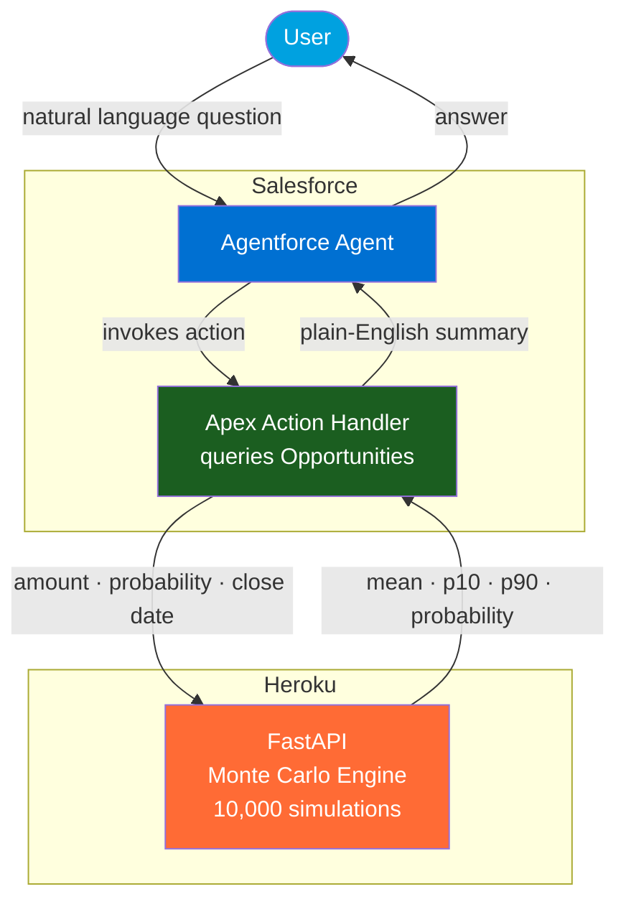

# Agentforce Monte Carlo Revenue Forecasting

> **Agentforce as Orchestrator** — a Salesforce Agentforce Agent that runs Monte Carlo
> simulations on live pipeline data to answer probability-based revenue questions.
>
> *"What's my chance of hitting $25M this quarter?"*
> *"What is my commit vs. best case?"*
> *"What if the Acme deal slips 30 days?"*

The agent queries the current user's open Opportunities in real time, ships only the
anonymized deal math to a stateless simulation engine on Heroku, runs 10,000 Monte Carlo
scenarios, and returns a plain-English answer — in under a second.

---

## Three Capabilities

### 1. Revenue Forecast
*"Will I hit $25M this quarter?"* / *"Am I on track for quota?"*

Runs a single Monte Carlo simulation against all open opportunities and returns the
probability of hitting a specific revenue target, the expected outcome, and the realistic
range (P10–P90).

### 2. Forecast Scenarios — Commit / Most Likely / Best Case
*"What is my commit vs. best case?"* / *"Show me my forecast scenarios"*

Runs three Monte Carlo simulations in one call, each filtering the pipeline by a different
probability threshold to produce the standard sales forecasting tiers:

| Tier | Deals Included | Threshold |
|------|---------------|-----------|
| **Commit** | High-confidence only | Probability ≥ 80% |
| **Most Likely** | Likely to close | Probability ≥ 50% |
| **Best Case** | Everything in pipeline | All open deals |

A revenue target is optional — without one, each tier returns its expected revenue range.
With one, each tier also shows the probability of hitting that target.

### 3. What-If Scenario Analysis
*"What if the Acme deal slips 30 days?"* / *"What if TechCo drops to 40%?"*

Finds a named deal in the pipeline by partial name match, runs a baseline simulation,
applies a hypothetical change in memory (no Salesforce data is modified), runs the scenario
simulation, and returns a before/after comparison with the net probability impact.

Supports two types of changes (or both at once):
- **Probability change** — `newProbabilityPct`: e.g., 40 means the deal drops to 40%
- **Close date slip** — `closeDateSlipDays`: e.g., 30 means the deal pushes one month

---

## How It Works

```
User: "Will I hit $25M this quarter?"

Agentforce LLM Orchestrator
  → recognizes forecasting intent
  → invokes Run Revenue Forecast action (revenueTarget = 25000000)

MonteCarloActionHandler.cls  [Apex, with sharing]
  → SOQL: SELECT Amount, Probability, CloseDate
          FROM Opportunity
          WHERE IsClosed = false
          AND CloseDate <= [end of current quarter]
          [scoped to current user automatically via with sharing]

POST https://monte-carlo-forecast-0b7519dafaaf.herokuapp.com/api/v1/simulate
  → { opportunities: [{ amount, probability, close_date }, ...] }
  → 10,000 Monte Carlo simulations (~50ms, NumPy vectorized)

Response: { mean: $22.4M, p10: $18.1M, p90: $27.6M, target_probability: "68.3%" }

Agentforce LLM → User:
  "Based on your 14 open opportunities, you have a 68.3% chance of hitting $25M
   this quarter. Your expected revenue is $22.4M, with a realistic range of
   $18.1M (pessimistic) to $27.6M (optimistic)."
```

---

## The Simulation Math

The Monte Carlo engine runs vectorized simulations using NumPy:

1. Build arrays of `amounts` and `probabilities` from your open Opportunities
2. Generate a random draw matrix (`num_simulations × n_deals`)
3. `won_matrix = random_draws < probabilities` — each deal is independently won or lost
4. `revenue_per_run = (won_matrix × amounts).sum(axis=1)` — total revenue per simulation
5. Aggregate: mean, p10, p90, and probability of hitting each revenue target

**Default: 10,000 simulations. Each run takes ~50ms.**

Unlike weighted pipeline (which gives one deterministic number), Monte Carlo surfaces
the full distribution — so you see not just the expected outcome, but how wide the
cone of uncertainty is.

---

## Architecture



**What this diagram shows:**
- Salesforce Opportunities stay in Salesforce — only deal math (`amount`, `probability`, `close_date`) leaves
- `with sharing` on all Apex classes automatically scopes SOQL to the current user
- The simulation service is fully stateless — no data stored after the HTTP response
- The LLM never sees raw Opportunity data — only the computed narrative summary

---

## Agent Action Inputs & Outputs

### Action 1: Run Revenue Forecast

**Inputs**

| Input | Type | Required | Description |
|-------|------|----------|-------------|
| `revenueTarget` | Number | Yes | Dollar amount to forecast. Extracted from user message — e.g., "Will I hit $25M?" → `25000000` |
| `timeHorizonDays` | Number | No | Days from today to include. Blank = auto-calculates end of current quarter |

**Outputs**

| Output | Type | Description |
|--------|------|-------------|
| `summary` | String | Plain-English answer — read directly to the user |
| `targetProbabilityPct` | String | Probability of hitting the target, e.g., `"68.3%"` |
| `expectedRevenue` | Number | Mean revenue across all simulations (USD) |
| `p10Revenue` | Number | 10th percentile — pessimistic scenario |
| `p90Revenue` | Number | 90th percentile — optimistic scenario |
| `opportunitiesAnalyzed` | Number | Count of open opportunities included |
| `success` | Boolean | `true` if simulation completed successfully |
| `errorMessage` | String | Error description if `success` is false |

---

### Action 2: Run Forecast Scenarios

**Inputs**

| Input | Type | Required | Description |
|-------|------|----------|-------------|
| `revenueTarget` | Number | No | Optional dollar target. If provided, each tier shows probability of hitting it. If omitted, each tier shows expected revenues only |
| `timeHorizonDays` | Number | No | Blank = auto-calculates end of current quarter |

**Outputs** (per tier: `commit*`, `mostLikely*`, `bestCase*`)

| Output | Type | Description |
|--------|------|-------------|
| `overallSummary` | String | Combined narrative comparing all three tiers — read directly to the user |
| `commitProbabilityPct` | String | Probability of hitting target with committed deals (≥80%) |
| `commitExpectedRevenue` | Number | Mean revenue in Commit scenario |
| `commitP10Revenue` | Number | Pessimistic floor for Commit scenario |
| `commitP90Revenue` | Number | Optimistic ceiling for Commit scenario |
| `commitOppsCount` | Number | Deals qualifying for Commit tier |
| *(same pattern for `mostLikely*` and `bestCase*`)* | | |
| `success` | Boolean | `true` if all three simulations completed |
| `errorMessage` | String | Error description if `success` is false |

---

### Action 3: Run What-If Scenario

**Inputs**

| Input | Type | Required | Description |
|-------|------|----------|-------------|
| `dealSearchTerm` | String | Yes | Partial deal or account name — e.g., `"Acme"` matches `"Acme Corp Enterprise Deal"` |
| `revenueTarget` | Number | Yes | Dollar target for before/after probability comparison |
| `newProbabilityPct` | Number | No | New win probability for the matched deal (0–100). Leave blank to keep existing |
| `closeDateSlipDays` | Number | No | Push close date forward by this many days. Leave blank to keep existing |
| `timeHorizonDays` | Number | No | Blank = auto-calculates end of current quarter |

**Outputs**

| Output | Type | Description |
|--------|------|-------------|
| `overallSummary` | String | Before/after comparison narrative — read directly to the user |
| `dealFound` | String | Full name of the matched opportunity |
| `baselineProbabilityPct` | String | Probability with current unmodified pipeline |
| `baselineExpectedRevenue` | Number | Mean revenue with current pipeline |
| `scenarioProbabilityPct` | String | Probability after applying the what-if change |
| `scenarioExpectedRevenue` | Number | Mean revenue after the what-if change |
| `probabilityChange` | String | Net impact, e.g., `"+12.4%"` or `"-8.1%"` |
| `success` | Boolean | `true` if analysis completed |
| `errorMessage` | String | Error description if `success` is false |

---

## Example Utterances

**Revenue Forecast:**
- *"Will I hit $25 million this quarter?"*
- *"What's my probability of closing $10M by end of Q1?"*
- *"Am I on track for my $8M quota?"*
- *"Give me a realistic revenue range for the next 30 days"*

**Forecast Scenarios:**
- *"What is my commit vs. best case?"*
- *"Show me my forecast scenarios this quarter"*
- *"What's my commit vs. best case for $25M?"*
- *"What's my upside this quarter?"*

**What-If Scenario:**
- *"What if the Acme deal slips 30 days? Will I still hit $25M?"*
- *"What happens to my $20M target if TechCo drops to 40%?"*
- *"What if GlobalBank pushes to next quarter?"*
- *"What if I close the Acme deal this week at 95% — does that get me to $25M?"*

---

## Data Residency

Designed to answer *"what leaves Salesforce?"* clearly.

**Leaves Salesforce (3 fields per opportunity):**
- `amount` — deal size as a number
- `probability` — win probability as a decimal (0.0–1.0)
- `close_date` — expected close date (ISO format)
- Opportunity `Id` as an anonymized internal identifier (not used in computation)

**Never leaves Salesforce:**
- Account names, opportunity names, contact names
- Owner names or user details
- Any custom fields or other standard fields

**Why this is safe:**
The simulation engine only needs the mathematical inputs. The response contains only
computed statistics — no raw data is echoed back. All computation runs in ephemeral
memory; nothing is stored after the HTTP response completes.

For regulated industries, the service can be deployed in a customer-controlled
VPC (AWS Lambda) or on-premise to keep even the anonymous statistical data
inside the customer's environment.

---

## Repository Structure

```
├── api/
│   ├── main.py          FastAPI app, routes, OpenAPI 3.0 schema endpoint
│   ├── models.py        Pydantic request/response models
│   ├── simulation.py    Monte Carlo engine (NumPy vectorized)
│   └── config.py        Environment-based configuration (pydantic-settings)
│
├── salesforce/
│   ├── force-app/main/default/
│   │   ├── classes/
│   │   │   ├── MonteCarloActionHandler.cls              Revenue Forecast (1 callout)
│   │   │   ├── MonteCarloActionHandlerTest.cls
│   │   │   ├── ForecastScenariosActionHandler.cls       Commit/Most Likely/Best Case (3 callouts)
│   │   │   ├── ForecastScenariosActionHandlerTest.cls
│   │   │   ├── WhatIfScenarioActionHandler.cls          What-If analysis (2 callouts)
│   │   │   └── WhatIfScenarioActionHandlerTest.cls
│   │   ├── flows/
│   │   │   ├── Run_Revenue_Forecast_Monte_Carlo         AutoLaunched Flow — action 1
│   │   │   ├── Run_Forecast_Scenarios                   AutoLaunched Flow — action 2
│   │   │   └── Run_What_If_Scenario                     AutoLaunched Flow — action 3
│   │   ├── genAiFunctions/
│   │   │   ├── Run_Revenue_Forecast/                    Agentforce action definition
│   │   │   ├── Run_Forecast_Scenarios/                  Agentforce action definition
│   │   │   └── Run_What_If_Scenario/                    Agentforce action definition
│   │   ├── genAiPlugins/
│   │   │   └── Revenue_Forecasting                      Agentforce topic (all 3 actions)
│   │   ├── bots/
│   │   │   └── Monte_Carlo_Revenue_Forecaster/          Agent bot + version metadata
│   │   ├── namedCredentials/                            MonteCarlo_API endpoint config
│   │   └── remoteSiteSettings/                          Callout allowlist
│   ├── manifest/
│   │   └── package.xml                                  Deployment manifest
│   ├── specs/
│   │   └── monteCarlorevenueForecaster.yaml             Agent creation spec
│   └── README_SETUP.md                                  Salesforce setup guide
│
├── deploy/
│   ├── Dockerfile          Production container image
│   ├── docker-compose.yml  Local dev environment
│   └── deploy.sh           One-command deploy (local / Heroku / Lambda)
│
├── tests/
│   └── test_simulation.py  Unit tests for simulation math
│
├── docs/
│   ├── README.md               API reference and architecture deep-dive
│   └── WORKSHOP_WALKTHROUGH.md Facilitator guide for live demos
│
├── requirements.txt   Pinned Python dependencies
└── .env.example       Configuration template
```

---

## Quick Start — Local API

```bash
# Clone and configure
git clone https://github.com/ejochims/Agentforce-Monte-Carlo-Analysis.git
cd Agentforce-Monte-Carlo-Analysis
cp .env.example .env

# Start with Docker (hot-reload)
./deploy/deploy.sh local
# → API running at http://localhost:8000
# → Interactive docs at http://localhost:8000/docs
```

**Run a sample simulation:**

```bash
curl -X POST http://localhost:8000/api/v1/simulate \
  -H "Content-Type: application/json" \
  -d '{
    "opportunities": [
      {"name": "Deal A", "amount": 5000000, "probability": 0.75, "close_date": "2026-03-31"},
      {"name": "Deal B", "amount": 3000000, "probability": 0.60, "close_date": "2026-03-15"},
      {"name": "Deal C", "amount": 8000000, "probability": 0.40, "close_date": "2026-03-31"},
      {"name": "Deal D", "amount": 2000000, "probability": 0.90, "close_date": "2026-02-28"}
    ],
    "num_simulations": 10000,
    "revenue_targets": [10000000, 15000000, 20000000]
  }'
```

---

## Quick Start — Salesforce Deployment

**Prerequisites:** Salesforce org with Agentforce enabled, `sf` CLI installed.

```bash
# Deploy all metadata in one command:
# Apex classes + tests, AutoLaunched Flows, GenAiFunctions, GenAiPlugin,
# Bot + BotVersion, Named Credential, Remote Site Setting
sf project deploy start \
  --manifest salesforce/manifest/package.xml \
  --target-org <your-org-alias>
```

After deployment:
1. Setup → Agentforce → Agents → open your agent
2. Topics tab → **Add Topic from Org** → select **Revenue Forecasting**
3. Activate the agent
4. Try: *"What's my probability of hitting $10M this quarter?"*

See `salesforce/README_SETUP.md` for the full configuration walkthrough including
Named Credential setup and troubleshooting.

---

## Running Tests

**Python (simulation engine):**

```bash
cd api
pip install -r ../requirements.txt pytest httpx pytest-cov
pytest ../tests/ -v                                   # all tests
pytest ../tests/test_simulation.py::TestMonteCarloMath -v  # math only
pytest ../tests/ --cov=. --cov-report=term-missing    # with coverage
```

**Salesforce Apex:**

```bash
# Run all three test classes
sf apex run test \
  --class-names MonteCarloActionHandlerTest,ForecastScenariosActionHandlerTest,WhatIfScenarioActionHandlerTest \
  --target-org <your-org-alias> \
  --result-format human
```

---

## Deployment

The live API is deployed at `https://monte-carlo-forecast-0b7519dafaaf.herokuapp.com`.

All Salesforce metadata already points to this URL — no configuration needed for demos.

| Target | Command |
|--------|---------|
| Local (Docker) | `./deploy/deploy.sh local` |
| Heroku | `./deploy/deploy.sh heroku --app <app-name>` |
| AWS Lambda | `./deploy/deploy.sh lambda --function-name monte-carlo-forecast --region us-east-1` |

**Health check:** `https://monte-carlo-forecast-0b7519dafaaf.herokuapp.com/health`

**API docs:** `https://monte-carlo-forecast-0b7519dafaaf.herokuapp.com/docs`
