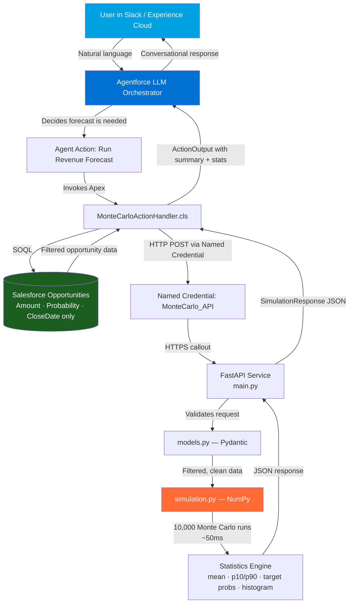

# Monte Carlo Revenue Forecast — Agentforce Integration

A stateless Monte Carlo simulation service that plugs into Salesforce Agentforce,
letting your AI Agent answer questions like:

> *"What's our chance of hitting $10M this quarter?"*
> *"Give me a realistic forecast range for Q1 based on current pipeline."*

---

## Architecture



**Data flows from left to right. Notice:**
- Salesforce Opportunities stay in Salesforce — only `amount`, `probability`, and `close_date` are sent externally
- The simulation service is stateless — no data is stored after the response
- The Agentforce LLM never touches raw data — it only sees the narrative summary

---

## Quick Start (Local Dev, under 5 minutes)

### Prerequisites
- Docker Desktop installed and running
- Git

### Steps

```bash
# 1. Clone the repo
git clone <repo-url>
cd monte-carlo-forecast

# 2. Copy the example environment file
cp .env.example .env

# 3. Start the service
./deploy/deploy.sh local

# 4. Test it
curl http://localhost:8000/health
# → {"status":"ok","version":"1.0.0","timestamp":"..."}
```

Open the interactive API docs at **http://localhost:8000/docs** — you can test
the simulation endpoint right from your browser.

### Run a sample simulation

```bash
curl -X POST http://localhost:8000/api/v1/simulate \
  -H "Content-Type: application/json" \
  -d '{
    "opportunities": [
      {"name": "Deal A", "amount": 2500000, "probability": 0.75, "close_date": "2025-03-31"},
      {"name": "Deal B", "amount": 1200000, "probability": 0.60, "close_date": "2025-03-15"},
      {"name": "Deal C", "amount": 800000,  "probability": 0.90, "close_date": "2025-02-28"},
      {"name": "Deal D", "amount": 5000000, "probability": 0.30, "close_date": "2025-03-31"},
      {"name": "Deal E", "amount": 3000000, "probability": 0.50, "close_date": "2025-04-15"}
    ],
    "num_simulations": 10000,
    "time_horizon_days": 90,
    "revenue_targets": [3000000, 6000000, 10000000]
  }'
```

**Expected response structure:**
```json
{
  "summary_statistics": {
    "mean": 5847200,
    "median": 5950000,
    "p10": 3300000,
    "p90": 8100000,
    "std_dev": 1842000,
    "total_pipeline_value": 12500000,
    "weighted_pipeline_value": 6435000
  },
  "target_analysis": [
    {"target": 3000000, "probability": 0.912, "probability_pct": "91.2%"},
    {"target": 6000000, "probability": 0.487, "probability_pct": "48.7%"},
    {"target": 10000000, "probability": 0.089, "probability_pct": "8.9%"}
  ],
  "histogram_buckets": [...],
  "metadata": {
    "num_simulations": 10000,
    "opportunities_included": 4,
    "opportunities_filtered_out": 1,
    "compute_time_ms": 52.4,
    "timestamp": "2025-01-15T14:32:00Z"
  }
}
```

---

## API Reference

### `POST /api/v1/simulate`

Run a Monte Carlo revenue simulation.

**Request body:**

| Field | Type | Required | Description |
|-------|------|----------|-------------|
| `opportunities` | array | Yes | List of deals (see below) |
| `num_simulations` | integer | No | Iterations (default: 10,000, max: 100,000) |
| `time_horizon_days` | integer | No | Filter to deals closing within N days |
| `revenue_targets` | array | No | USD targets to analyze (default: 1M/5M/10M/25M/50M) |

**Opportunity fields:**

| Field | Type | Description |
|-------|------|-------------|
| `name` | string | Identifier (not used in computation) |
| `amount` | number | Deal value in USD |
| `probability` | number | Win probability 0.0–1.0 |
| `close_date` | string | ISO date YYYY-MM-DD |

### `GET /health`

Returns `{"status": "ok"}` when the service is running.

### `GET /api/v1/schema`

Returns the OpenAPI 3.0 spec. Use this URL when registering the External Service in Salesforce.

---

## Registering as a Salesforce External Service

1. Deploy the service to a public URL (see Deployment section below)
2. In Salesforce Setup: **Integrations → External Services → New**
3. Enter the schema URL: `https://your-service.com/api/v1/schema`
4. Follow the detailed walkthrough in `salesforce/README_SETUP.md`

---

## Deployment

### Option 1: Heroku (recommended for demos)

```bash
# One-time setup
heroku create your-app-name
heroku config:set PORT=\$PORT  # Heroku sets this automatically

# Deploy
./deploy/deploy.sh heroku --app your-app-name
```

After deploy, your schema URL is: `https://your-app-name.herokuapp.com/api/v1/schema`

### Option 2: AWS Lambda (production-ready)

```bash
# Requires: AWS CLI configured, ECR repository created
./deploy/deploy.sh lambda --function-name monte-carlo-forecast --region us-east-1
```

Add API Gateway (HTTP API) in front for a public HTTPS URL.

### Option 3: Local (for setup/testing)

```bash
./deploy/deploy.sh local
```

For testing Salesforce integration locally, use `ngrok` to expose localhost:

```bash
ngrok http 8000
# Gives you: https://abc123.ngrok.io
# Use https://abc123.ngrok.io/api/v1/schema in Salesforce
```

---

## How to Wire Up the Agent Action

See the complete step-by-step guide in `salesforce/README_SETUP.md`.

**TL;DR:**
1. Deploy Apex class (`sf project deploy start --source-dir salesforce/classes/`)
2. Create Named Credential pointing to your service URL
3. Register External Service using `/api/v1/schema` URL
4. Create Agent Action in Setup → Agent Studio → Actions → New
5. Write the instruction: *"Use when user asks about revenue probability or pipeline forecasts..."*

---

## Data Residency

This is designed for customers who ask _"what data leaves Salesforce?"_

**What leaves Salesforce:**
- `amount` (deal size as a number)
- `probability` (win probability as a decimal)
- `close_date` (expected close date)
- An internal opportunity ID (for correlation only — stripped from processing)

**What never leaves Salesforce:**
- Account names
- Contact names or emails
- Opportunity names
- User names
- Any custom fields

**Why this is safe:**
The simulation service only needs the statistical inputs to run math.
The response contains only computed statistics — no raw data is echoed back.
All computation happens in ephemeral memory and is gone after the HTTP response.

For regulated industries: this can be deployed in a customer-controlled VPC
(AWS) or on-premise to ensure even the anonymous statistical data never leaves
their environment.

---

## Running Tests

```bash
# From repo root
cd api
pip install -r ../requirements.txt
pip install pytest httpx

# Run all tests
pytest ../tests/ -v

# Run a specific test class
pytest ../tests/test_simulation.py::TestMonteCarloMath -v

# Run with coverage report
pip install pytest-cov
pytest ../tests/ --cov=. --cov-report=term-missing
```

---

## Project Structure

```
monte-carlo-forecast/
├── api/
│   ├── main.py          — FastAPI app, routes, OpenAPI schema endpoint
│   ├── models.py        — Pydantic request/response models
│   ├── simulation.py    — Monte Carlo engine (NumPy)
│   └── config.py        — Environment-based configuration
├── salesforce/
│   ├── classes/
│   │   ├── MonteCarloActionHandler.cls          — Invocable Apex class
│   │   └── MonteCarloActionHandler.cls-meta.xml — SFDX metadata
│   └── README_SETUP.md  — Step-by-step Salesforce configuration guide
├── deploy/
│   ├── Dockerfile       — Production container image
│   ├── docker-compose.yml — Local dev environment
│   └── deploy.sh        — One-command deployment to local/Heroku/Lambda
├── docs/
│   ├── README.md        — This file
│   └── WORKSHOP_WALKTHROUGH.md — Facilitator guide for live demos
├── tests/
│   └── test_simulation.py — Unit tests for simulation math
├── requirements.txt     — Pinned Python dependencies
└── .env.example         — Configuration template
```
